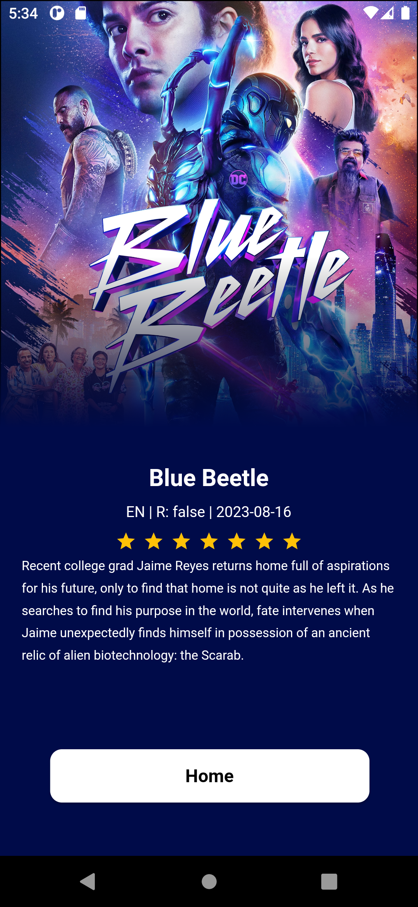

# Movie_app
This a basic movie app , displaying data from api , using riverpod for statemanagent, to get api key visit : https://www.themoviedb.org/ , note you have to sign up to get api key.

## Packages
 * flutter_riverpod
 * cached_network_image
 * shimmer
 * flutter_rating_bar
 * dio
   

## ScreenShots

   

   

## 🤓 Author(s)
**Micheal Olatunbosun**
